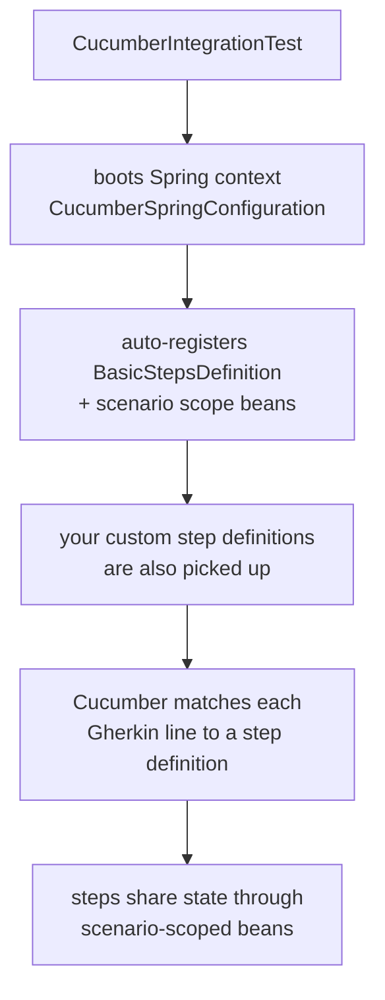

# Test Commons

[](https://www.apache.org/licenses/LICENSE-2.0)
[](https://mvnrepository.com/artifact/group.phorus/test-commons)

BDD integration testing library for Spring Boot WebFlux services. Provides reusable
[Cucumber](https://cucumber.io/) step definitions, scenario-scoped state management, and HTTP
test utilities so you can write Gherkin feature files for your service without repeating the
same boilerplate in every project.

### Notes

> The project runs a vulnerability analysis pipeline regularly,
> any found vulnerabilities will be fixed as soon as possible.

> The project dependencies are being regularly updated by [Renovate](https://github.com/phorus-group/renovate).
> Dependency updates that don't break tests will be automatically deployed with an updated patch version.

> The project has been thoroughly tested to ensure that it is safe to use in a production environment.

## Table of contents

- [What is BDD testing?](#background-what-is-bdd-testing)
- [Features](#features)
- [Getting started](#getting-started)
  - [Installation](#installation)
  - [Quick start](#quick-start)
- [How it works](#how-it-works)
- [Built-in step definitions](#built-in-step-definitions)
  - [Endpoint calls](#endpoint-calls)
  - [HTTP status asserts](#http-status-asserts)
  - [Passing parameters and headers](#passing-parameters-and-headers)
  - [Dynamic path variables](#dynamic-path-variables)
- [Scenario scopes](#scenario-scopes)
  - [BaseScenarioScope](#basescenarioscope)
  - [BaseRequestScenarioScope](#baserequestscenarioscope)
  - [BaseResponseScenarioScope](#baseresponsescenarioscope)
  - [Extending scenario scopes](#extending-scenario-scopes)
- [RestResponsePage](#restresponsepage)
- [Writing custom step definitions](#writing-custom-step-definitions)
- [Building and contributing](#building-and-contributing)
- [Authors and acknowledgment](#authors-and-acknowledgment)

***

## What is BDD testing?

If you are already familiar with BDD and Cucumber, feel free to skip to [Features](#features).

**Behavior-Driven Development (BDD)** is a testing approach where you describe the expected behavior
of your application in plain language using **Gherkin** syntax. Each scenario reads like a story:

```gherkin
Feature: User management

  Scenario: Successfully create a new user
    Given the caller has a valid user request
    When the POST "/user" endpoint is called
    Then the service returns HTTP 201
```

[Cucumber](https://cucumber.io/) is the framework that runs these `.feature` files. Each line in a
scenario maps to a **step definition**, a Kotlin function annotated with `@Given`, `@When`, or
`@Then` that contains the actual test logic.

In a Spring Boot WebFlux service, the test logic typically involves:

1. **Preparing state** (creating entities, building request bodies)
2. **Calling an HTTP endpoint** via `WebTestClient`
3. **Asserting the response** (status code, body content)

This library extracts the common parts, HTTP calls, status assertions, request/response state, into
reusable step definitions and scenario-scoped beans that all your services can share.

## Features

- **Built-in step definitions** for HTTP calls (`GET`, `POST`, `PUT`, `DELETE`) with query parameters, headers, and path variables
- **Scenario-scoped state** beans to share data between steps within a single scenario
- **Type-safe helper extensions** like `bodyAs<T>()`, `pageBodyAs<T>()`, and `get<T>()` for clean deserialization and state retrieval
- **Dynamic path variable resolution** using `{variableName}` placeholders in endpoint URLs
- **`RestResponsePage`** for deserializing Spring `Page` responses in tests
- **Automatic registration**, add the dependency and the beans are available via Spring autoconfiguration
- **Extensible**, add your own step definitions that build on the provided scenario scopes

## Getting started

### Installation

Make sure that `mavenCentral` (or any of its mirrors) is added to the repository list of the project.

Binaries and dependency information for Maven and Gradle can be found at [http://search.maven.org](https://search.maven.org/search?q=g:group.phorus%20AND%20a:test-commons).

<details open>
<summary>Gradle / Kotlin DSL</summary>

```kotlin
testImplementation("group.phorus:test-commons:x.y.z")
```
</details>

<details open>
<summary>Maven</summary>

```xml
<dependency>
    <groupId>group.phorus</groupId>
    <artifactId>test-commons</artifactId>
    <version>x.y.z</version>
    <scope>test</scope>
</dependency>
```
</details>

### Quick start

To get BDD tests running in your service you need three things:

**1. A Cucumber runner class:**

```kotlin
@Suite
@IncludeEngines("cucumber")
@SelectClasspathResource("features")
@ConfigurationParameter(key = GLUE_PROPERTY_NAME, value = "group.phorus")
internal class CucumberIntegrationTest
```

The glue path tells Cucumber where to scan for step definitions. `"group.phorus"` finds the
library's built-in steps. If your service uses a different base package (e.g., `com.example`),
add both packages comma-separated:

```kotlin
@ConfigurationParameter(key = GLUE_PROPERTY_NAME, value = "group.phorus,com.example")
```

**2. A Spring configuration class annotated, at minimum, with `@CucumberContextConfiguration` and `@SpringBootTest`:**

```kotlin
@SpringBootTest(webEnvironment = SpringBootTest.WebEnvironment.RANDOM_PORT)
@CucumberContextConfiguration
@AutoConfigureWebTestClient
@ActiveProfiles("test")
class CucumberSpringConfiguration
```

**3. Feature files** in `src/test/resources/features/`:

```gherkin
Feature: User management

  Scenario: Create a user
    Given a user request is prepared
    When the POST "/user" endpoint is called
    Then the service returns HTTP 201
```

In this example, the `Given` step is something you define in your own step definition class. The `When` and `Then`
steps come from the library's `BasicStepsDefinition`.

## How it works

When your test suite runs:



For each scenario, Spring creates fresh instances of the scenario scope beans. This means state from
one scenario never leaks into another.

## Built-in step definitions

The library provides `BasicStepsDefinition` with the following steps out of the box.

### Endpoint calls

The library provides two step patterns for making HTTP calls.

**Basic endpoint call** (no query parameters or headers):

```gherkin
When the GET "/entity" endpoint is called
When the POST "/entity" endpoint is called
When the PUT "/entity/{id}" endpoint is called
```

Pattern: `When the <METHOD> "<path>" endpoint is called`

Where `<METHOD>` is any HTTP method (`GET`, `POST`, `PUT`, `DELETE`, `PATCH`).

**Endpoint call with query parameters and/or headers**:

```gherkin
When the GET "/entity" endpoint is called:
  | type   | key           | value   |
  | header | Authorization | {token} |

When the GET "/entity/search" endpoint is called:
  | type   | key           | value   |
  | header | Authorization | {token} |
  | param  | page          | 0       |
  | param  | size          | 2       |
```

Pattern: `When the <METHOD> "<path>" endpoint is called:` followed by a DataTable with columns:
- `type`: Either `param` (query parameter) or `header` (HTTP header)
- `key`: The parameter or header name
- `value`: The value (supports `{placeholder}` resolution, see below)

**How it works:**

The step uses `WebTestClient` to make the HTTP call. If a request body is needed (`POST`/`PUT`),
it reads it from `BaseRequestScenarioScope.request` (you must set this in a previous `Given` step).
The response is saved in `BaseResponseScenarioScope`.

**Placeholder resolution:**

Curly brackets `{variableName}` are dynamic placeholders resolved from `BaseScenarioScope.objects`.
This works in **three places**:
1. **Path variables**: `/entity/{id}` -> `/entity/550e8400-e29b-41d4-a716-446655440000`
2. **Parameter values**: `| param | filter | {filterValue} |` -> `?filter=someValue`
3. **Header values**: `| header | Authorization | {token} |` -> `Authorization: Bearer ...`

The `{variableName}` syntax looks up `BaseScenarioScope.objects["variableName"]` and replaces the
placeholder with its string value.

**Multi-value parameters:**

Multiple rows with the same `key` and `type=param` create a multi-value query parameter:

```gherkin
When the POST "/test" endpoint is called:
  | type  | key  | value      |
  | param | test | testParam1 |
  | param | test | testParam2 |
```

This produces `?test=testParam1&test=testParam2`.

### HTTP status asserts

```gherkin
Then the service returns HTTP 200
Then the service returns HTTP 201
Then the service returns HTTP 404
```

## Scenario scopes

The library provides three scenario-scoped beans that are automatically registered. They are created
fresh for each scenario and destroyed after it completes.

### BaseScenarioScope

A general-purpose key-value store for sharing data between steps.

```kotlin
@Component
@ScenarioScope
class BaseScenarioScope(
    var objects: MutableMap<String, Any> = mutableMapOf(),
)
```

Use it to pass entity IDs, tokens, or any object between `Given`, `When`, and `Then` steps:

```kotlin
// In a Given step
baseScenarioScope.objects["entityId"] = createdEntity.id.toString()

// In a When step, {entityId} in the URL is resolved automatically
// When the GET "/entity/{entityId}" endpoint is called
```

The `get()` extension provides a type-safe way to retrieve values:

```kotlin
val id: String? = baseScenarioScope.get("entityId")
```

### BaseRequestScenarioScope

Holds the request body for the next HTTP call.

```kotlin
@Component
@ScenarioScope
class BaseRequestScenarioScope(
    var request: Any? = null,
)
```

Set `request` in your `Given` step, `BasicStepsDefinition` picks it up as the request body:

```kotlin
@Given("the caller has an entity request")
fun `the caller has an entity request`() {
    requestScenarioScope.request = EntityDTO(name = "Example", description = "Test data")
}
```

### BaseResponseScenarioScope

Holds the captured HTTP response for the current scenario. The response body is eagerly buffered
after each HTTP call, so it can be read multiple times across different steps.

```kotlin
@Component
@ScenarioScope
class BaseResponseScenarioScope(
    var statusCode: Int? = null,
    var responseHeaders: HttpHeaders? = null,
    var responseBody: ByteArray? = null,
)
```

Use the `bodyAs()` extension to deserialize the buffered response body. It preserves full generic
type parameters, making it safe with parameterized types:

```kotlin
@Then("the response contains the entity")
fun `the response contains the entity`() {
    val body = responseScenarioScope.bodyAs<EntityResponse>(objectMapper)!!

    assertEquals("Example", body.name)
}
```

For paginated responses, `pageBodyAs()` is a shorthand that wraps the type in `RestResponsePage`:

```kotlin
val page = responseScenarioScope.pageBodyAs<EntityResponse>(objectMapper)!!
assertEquals(1, page.totalElements)
```

You can also access the raw fields directly when needed:

```kotlin
val status = responseScenarioScope.statusCode
val raw = responseScenarioScope.responseBody?.toString(Charsets.UTF_8)
val headers = responseScenarioScope.responseHeaders
```

### Extending scenario scopes

You can extend any scope to add domain-specific state. Use `@Primary` so the library's
`BasicStepsDefinition` picks up your extended version:

```kotlin
@Component
@ScenarioScope
@Primary
class MyRequestScenarioScope(
    var extraField: String? = null,
) : BaseRequestScenarioScope()
```

## RestResponsePage

Spring's `Page` interface cannot be deserialized from JSON directly because it's an interface.
The library provides `RestResponsePage<T>`, a `PageImpl` subclass with Jackson annotations, so
you can deserialize paginated responses in your tests:

```kotlin
val page = responseScenarioScope.pageBodyAs<EntityResponse>(objectMapper)!!

assertEquals(1, page.totalElements)
assertEquals("Example", page.content.first().name)
```

## Writing custom step definitions

Create a class in your test source that autowires the scenario scopes:

### Setting up test data (Given steps)

```kotlin
// Creates an entity and stores IDs for later steps
class EntityStepDefinitions(
    @Autowired private val baseScenarioScope: BaseScenarioScope,
    @Autowired private val requestScenarioScope: BaseRequestScenarioScope,
    @Autowired private val entityRepository: EntityRepository,
) {
    @Given("an entity exists in the system")
    fun `an entity exists in the system`() {
        runBlocking {
            val entity = Entity(
                name = "Test Entity",
                description = "Test description"
            )

            val savedEntity = entityRepository.save(entity)

            // Store data in BaseScenarioScope for use by later steps
            baseScenarioScope.objects["entityId"] = savedEntity.id.toString()
            baseScenarioScope.objects["entityName"] = savedEntity.name
        }
    }
}
```

### Preparing requests (Given steps)

```kotlin
// Prepares a request using data from BaseScenarioScope
class RequestStepDefinitions(
    @Autowired private val baseScenarioScope: BaseScenarioScope,
    @Autowired private val requestScenarioScope: BaseRequestScenarioScope,
) {
    @Given("the caller has prepared an update request")
    fun `the caller has prepared an update request`() {
        val name = baseScenarioScope.objects["entityName"] as String

        // Set the request body, BasicStepsDefinition picks this up on the next When step
        requestScenarioScope.request = UpdateEntityRequest(
            name = "$name (updated)",
            description = "Updated description"
        )
    }
}
```

### Asserting responses (Then steps)

```kotlin
// Asserts the response body using BaseResponseScenarioScope
@Then("the response contains the entity data")
fun `the response contains the entity data`() {
    val response = responseScenarioScope.bodyAs<EntityResponse>(objectMapper)!!

    assertNotNull(response.id)
    assertNotNull(response.name)
    assertTrue(response.description.isNotBlank())
}

@Then("the response contains a token")
fun `the response contains a token`() {
    val response = responseScenarioScope.bodyAs<TokenResponse>(objectMapper)!!

    assertNotNull(response.accessToken)
    assertTrue(response.accessToken.token.isNotBlank())
}
```

## Building and contributing

See [Contributing Guidelines](CONTRIBUTING.md).

## Authors and acknowledgment

Developed and maintained by the [Phorus Group](https://phorus.group) team.
